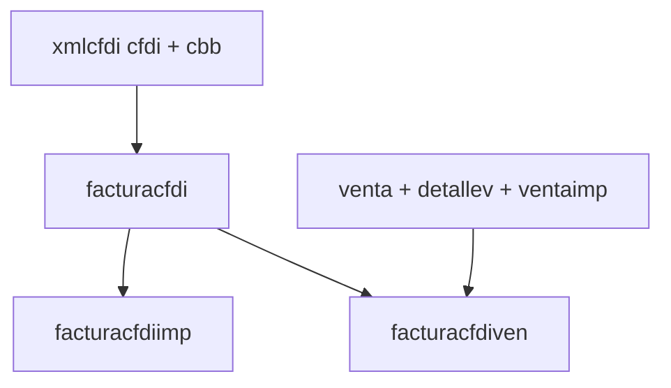

# Esquema SICAR — factura CFDI timbrada

Documentación generada desde la base `sicar` (referencia `fcf_id=3988`, serie `IMA-5261`).

## Flujo de persistencia



1. **venta** — venta con líneas en **detallev** e impuestos en **ventaimp**.
2. **Timbrado** — XML CFDI 4.0 firmado con CSD (`sellodigital`) y timbrado vía PAC (credenciales en **empresa**).
3. **xmlcfdi** — XML timbrado (`cfdi`) y QR PNG (`cbb`), `timbrado=1`.
4. **facturacfdi** — encabezado fiscal (emisor, receptor, totales, UUID, sellos).
5. **facturacfdiimp** — resumen de impuestos (p. ej. IVA 16%).
6. **facturacfdiven** — enlace `fcf_id` ↔ `ven_id`.

## Tablas clave

| Tabla | PK | Notas |
|-------|-----|--------|
| `seriecfdi` | `scf_id` | `serie`, `folioIni`, `emp_id`. Folio actual = `MAX(folio)` por `scf_id` en `facturacfdi`. |
| `empresa` | `emp_id` | Datos fiscales emisor; `claveApi`, `idDis`, `codDis` = PAC; ubicación fiscal en `*Ubi`. |
| `sellodigital` | `sdi_id` | CSD activo: `fCer`, `fKey`, `pwd` (cifrada en SICAR), `seleccionado=1`. |
| `cliente` | `cli_id` | Receptor; `rfc`, domicilio, `usoCfdi`, `rgf_id`. |
| `xmlcfdi` | `xcf_id` | `cfdi` (longblob XML), `cbb` (QR PNG), `timbrado`. |
| `facturacfdi` | `fcf_id` | 88 columnas; `serieFolio` UNIQUE; FK `scf_id`, `xcf_id`, `cli_id`, `caj_id`, `mon_id`. |
| `facturacfdiimp` | `fcf_id`+`imp_id` | IVA y demás impuestos trasladados. |
| `facturacfdiven` | `fcf_id`+`ven_id` | Liga factura con venta. |

## Campos obligatorios `facturacfdi` (INSERT)

`serieFolio`, `folio`, `rfcE`, domicilio emisor (`domicilioE`…`coloniaE`), `rfcC`, domicilio receptor, `fecha`, `subtotal0`, `subtotal`, `descuento`, `total`, `letra`, `formaPago`, `efectos`, `cadenaOriginal`, `noCertificado`, `status`, `cli_id`, `scf_id`, `xcf_id`, `caj_id`.

Valores típicos referencia: `status=1`, `caj_id=1`, `mon_id=1`, `versionCfdi=4.0`, `efectos=Efectos fiscales al pago`, `decimales=2`.

## PAC / CSD

- **CSD**: tabla `sellodigital` (fila `seleccionado=1`). Contraseña del `.key` en `pwd` (SICAR puede almacenarla cifrada).
- **PAC**: token en `empresa.claveApi`; timbrado vía SW (`https://services.sw.com.mx/cfdi/stamp/v4/xml`).

## Mapeo formulario DigitalFlow → SICAR

| Formulario | Destino |
|------------|---------|
| Cliente SICAR (`cli_id`) | `cliente` + campos `*C` en `facturacfdi` |
| Serie (`scf_id`) | `seriecfdi` → `serieFolio`, `folio` |
| Forma / método pago, uso CFDI | `formaPago`, `metodoPago`, `usoCfdi` |
| Conceptos | `detallev` (+ claves SAT `claveProdServ`, `claveUnidad`) |
| Totales | `venta`, `facturacfdi`, `facturacfdiimp`, `ventaimp` |

## Variables de entorno

```env
SICAR_DB_HOST=
SICAR_DB_PORT=3307
SICAR_DB_USER=
SICAR_DB_PASSWORD=
SICAR_DB_NAME=sicar
```
